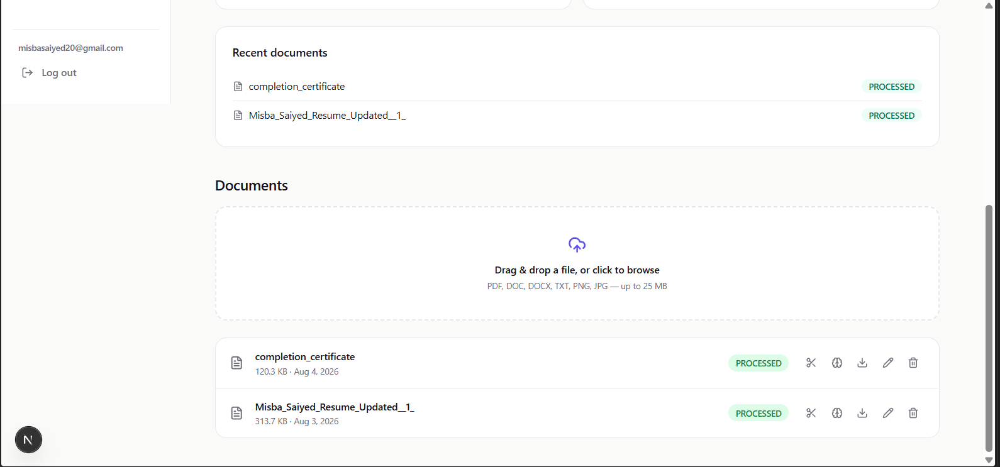
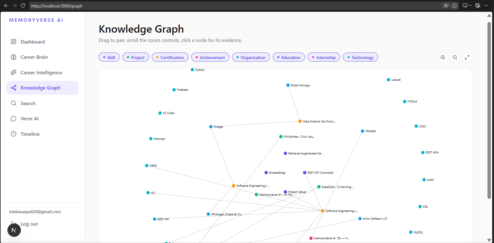
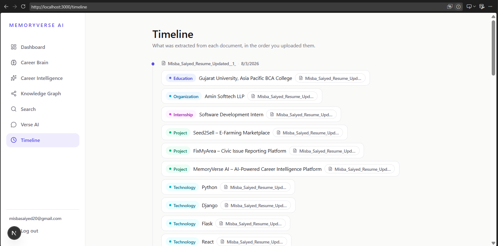
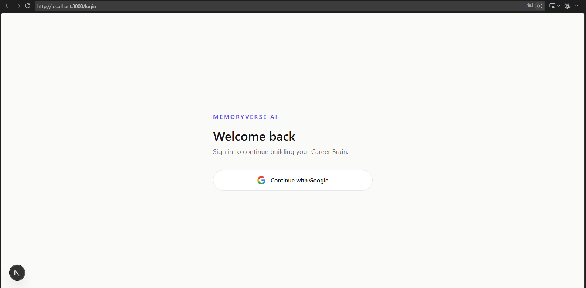
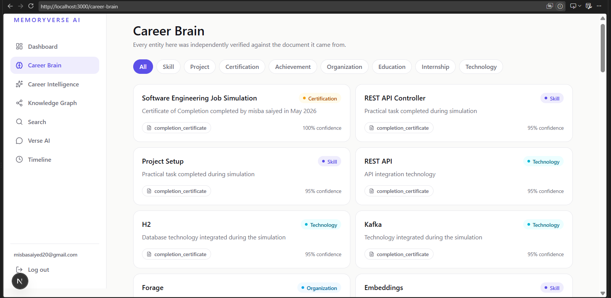
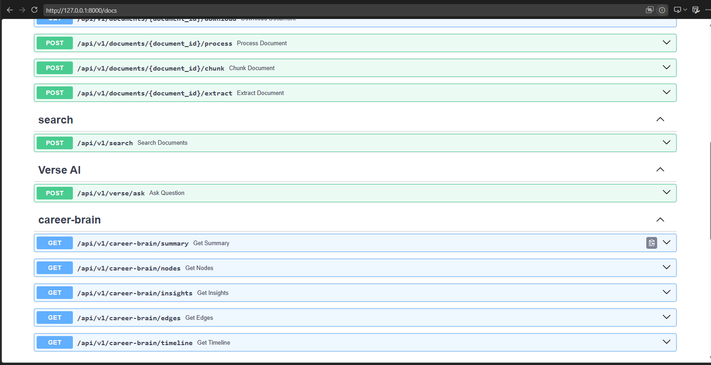

# 🧠 MemoryVerse AI

## AI-Powered Digital Identity System for Students & Professionals

MemoryVerse AI transforms scattered academic and professional records into an intelligent, searchable digital identity.

Students continuously generate valuable digital footprints through certificates, resumes, projects, internships, portfolios, and achievements. However, these records are usually distributed across folders, emails, cloud storage, and devices.

MemoryVerse AI aims to solve this problem by creating a centralized knowledge system that understands a person's journey, connects experiences, and makes important information instantly accessible.

---

# 🚀 Problem Statement

Traditional storage platforms only store files. They do not understand:

* What skills a student has developed
* Which projects demonstrate those skills
* Which certifications support their knowledge
* How experiences connect over time

MemoryVerse AI creates an intelligent layer over personal records to organize, analyze, and represent a user's professional growth.

---

# 💡 Solution Overview

MemoryVerse AI follows an AI-powered document intelligence pipeline:

```
Upload Documents
        |
        ↓
Document Processing
        |
        ↓
Text Extraction & Normalization
        |
        ↓
AI Understanding Layer
        |
        ↓
Career Knowledge Repository
        |
        ↓
Search, Insights & Digital Timeline
```

The system preserves original documents while building structured knowledge from uploaded information.

---

# ✨ Current Features

## 📂 Intelligent Document Management

Users can upload and manage academic/professional documents including:

* Resumes
* Certificates
* Project Reports
* Internship Documents
* Achievement Records

Original files remain accessible while metadata and processing information are maintained.

---

## ⚙️ Document Processing Pipeline

Implemented processing workflow:

* Document ingestion
* File validation
* Text extraction pipeline
* Text normalization
* Background processing architecture

This creates the foundation required for AI-powered document understanding.

---

## 🧩 Document Chunking System

Large documents are divided into meaningful smaller sections to prepare them for:

* Semantic search
* Embedding generation
* Retrieval-Augmented Generation (RAG)

Chunking improves future AI retrieval accuracy by allowing the system to search relevant sections instead of entire files.

---

## 📊 Dashboard & Analytics

The platform provides a dashboard layer for monitoring:

* Uploaded documents
* Processing status
* Document statistics

---

# 🏗️ System Architecture

```
                    User Documents
                          |
                          ↓
              Document Upload Service
                          |
                          ↓
              Processing Pipeline
                          |
              ---------------------
              |                   |
              ↓                   ↓
        Text Extraction       Metadata Storage
              |
              ↓
        AI Extraction Layer
              |
              ↓
        Career Brain Knowledge Model
              |
     -------------------------------
     |              |              |
   Skills       Projects    Certifications
     |
     ↓
Semantic Search + AI Insights
```

---

# 🛠️ Technology Stack

## Frontend

* Next.js 15
* TypeScript
* Tailwind CSS
* shadcn/ui

## Backend

* FastAPI
* Python
* SQLAlchemy

## Database

* PostgreSQL

## Authentication

* Firebase Authentication

## AI Roadmap

* Google Gemini
* NLP-based entity extraction
* Embeddings
* Vector Database
* Retrieval-Augmented Generation (RAG)

---

# 🧠 AI Knowledge Model (Career Brain)

The future intelligence layer of MemoryVerse AI is designed around a structured knowledge model.

Example relationships:

```
Certification
      |
      ↓
    Skill
      |
      ↓
   Project
      |
      ↓
 Internship
      |
      ↓
 Career Growth
```

This allows the system to understand not only documents, but the story behind them.

---

# 🔍 Smart Retrieval Vision

The goal is to enable natural language queries:

Examples:

> "Show my AI projects"

> "Find my latest resume"

> "Which certificates support my Python skills?"

> "Show my internship-related documents"

Using semantic search and RAG, users can retrieve information without manually searching folders.

---

# 📅 Digital Journey Timeline

MemoryVerse AI is designed to automatically generate a professional growth timeline:

Example:

```
2023 → Python Certification

2024 → Data Science Project

2025 → Industry Internship

2026 → AI Portfolio Development
```

---

# 📁 Project Structure

```
memoryverse-ai/

├── frontend/
│   ├── Next.js Application
│   └── UI Components

├── backend/
│   ├── FastAPI Application
│   ├── API Routes
│   ├── Database Models
│   ├── Processing Services
│   └── Document Pipeline

└── README.md
```

---

# ⚙️ Local Setup

## Backend

```bash
cd backend

python -m venv venv

pip install -r requirements.txt

uvicorn app.main:app --reload --port 8000
```

---

## Frontend

```bash
cd frontend

npm install

npm run dev
```

---

# 🎯 Hackathon Alignment - MemoryVerse AI '26

This project addresses the core challenge of creating an AI-powered Digital Identity System.

| Challenge Requirement    | Implementation                |
| ------------------------ | ----------------------------- |
| Data Ingestion           | ✅ Document upload system      |
| Intelligent Organization | ⚙️ AI extraction architecture |
| Knowledge Connections    | ⚙️ Career Brain design        |
| Digital Timeline         | ⚙️ Planned intelligence layer |
| Smart Retrieval          | ⚙️ RAG-ready architecture     |

---

# 🔮 Future Enhancements

* Gemini-powered document understanding
* Automatic skill extraction
* Knowledge graph generation
* ChromaDB/vector database integration
* Semantic search
* AI career insights
* Personalized professional recommendations

---
# 📸 Application Screenshots

## Dashboard


---

## Upload Documents



---

## Knowledge Graph



---

## Career Timeline



---

## memoryverse ai login



---

## Career Brain



---

## backend APIs



# 👩‍💻 Built For

**MemoryVerse AI '26 Hackathon**

Building the future of intelligent digital identity systems where your achievements are not just stored — they are understood.
